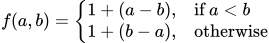
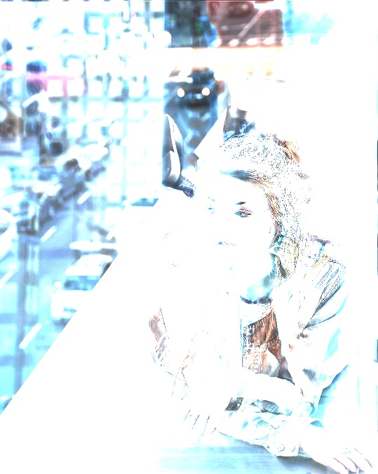
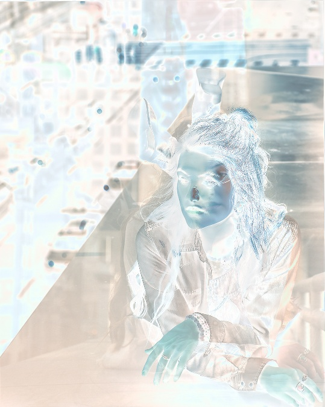
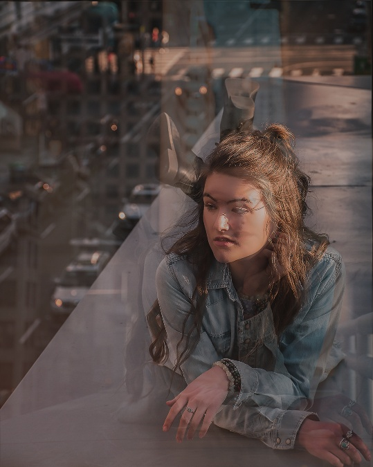

<h1 align="center">Blending Modes</h1>

<div align="center">
  :camera: :clipboard: :books: :clipboard: :camera:
</div>

<div align="center">
  <strong>Computational Photography concepts implemented from scratch</strong>
</div>

<br />

## Table of Contents

- **Theory**
- **Implementation**
- **Steps to run**
- **Output**

<br />

- ### Theory

  Blend modes in digital image editing and computer graphics are used to determine how two layers are blended with each other. The default blend mode in most applications is simply to obscure the lower layer by covering it with whatever is present in the top layer. However, as each pixel has a numerical representation, there exist a large number of ways to blend two layers.
  <br/>

  This is the standard blend mode which uses the top image alone, without mixing its values with the image beneath it:

  

  where a is the value of a underlying image, and b is that of the upper image. The result is most typically merged into the bottom layer using "simple" (b over a) alpha compositing (making the actual formula. The compositing step results in the top layer's shape, as defined by its alpha channel, appearing over the bottom layer.

- ### Implementation

  Depending on the blend modes, the pixels of the two images are computed according to the formulaes of blend modes and hence achieved the final result of the blended image.

  The Following steps for implementing blending of images is performed before the blending process
  The Algorithms Steps are:

  - Image is converted into 0-1 form
  - Both the input images are computed with the ratio mentioned
  - The lower layer or image is multiplied by ratio
  - The upper layer or image is multiplied by (1 - ratio)

  Code for the algorithm in python language:

  ```
    # Convert image from 0-255 to 0-1
    img1 = img1 / 255
    img2 = img2 / 255

    if ratio < 1:
        input1 = input1 * ratio
        input2 = input2 * (1 - ratio)
  ```

  Once the images are converted they are performed the blending process according to their formalaes.
  the following formulaes are:

  | Blend Mode | Formulae                             |
  | ---------- | ------------------------------------ |
  | Addition   |      |
  | Subtract   |      |
  | Divide     |          |
  | Multiply   |      |
  | Darken     |          |
  | Lighten    |        |
  | Difference |  |
  | Screen     |          |
  | Overlay    |        |

  > **NOTE: While performing the blend modes the overflow of image pixels are handled accordingly in the algorithms**

  Using these listed formulaes the blending of two images are performed.

- ### Steps to Run

  Make sure you have Python Installed in your computer. To check if you've python installed, run the following command in command prompt

  `Python --version`

  

  Once you have python Installed in your device follow the next steps to run the program:

  1. `git clone <Repository Link>`
  2. cd into the "Gaussian_Blur" folder
  3. Run the following command

     `py main.py`

  To Change the image open the code file and change the Image to your choice

  The Following Parameters which can be changed to adjust the form of output

  > **Debug -> If True, The code will display image output after processing every step**

  > **Save -> If True, the Output of the Image will be Saved in the Output Directory.**

  > **Resize -> If True, The Input Image will be Resized to a given ratio, you can change the ratio according to your needs.**

  > **Ratio -> The Ratio determine the intensity of the upper image blended with the lower image (Upper Image : Lower Image)**

- ### Output

  **The Ratio Taken to Compute these blend modes are "Input1 : Input2 = 65 : 45".**

  - #### **Input Image**

    

    

  - #### Addition

    

  - #### Subtract

    

  - #### Divide

    

  - #### Multiply

    

  - #### Darken

    

  - #### Lighten

    

  - #### Difference

    

  - #### Screen

    

  - #### Overlay

    
