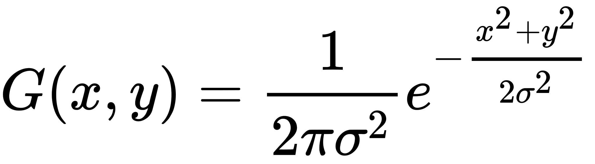
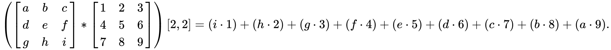
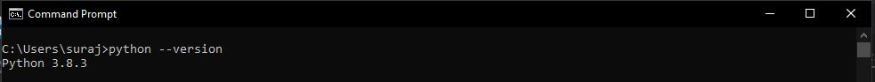

<h1 align="center">Gaussian Blur</h1>

<div align="center">
  :camera: :clipboard: :books: :clipboard: :camera:
</div>

<div align="center">
  <strong>Computational Photography concepts implemented from scratch</strong>
</div>

<br />

## Table of Contents

- **Theory**
- **Implementation**
- **Steps to run**
- **Output**

<br />

- ### Theory

  In image processing, a Gaussian blur (also known as Gaussian smoothing) is the result of blurring an image by a Gaussian function

  It is a widely used effect in graphics software, typically to reduce image noise and reduce detail. The visual effect of this blurring technique is a smooth blur resembling that of viewing the image through a translucent screen, distinctly different from the bokeh effect produced by an out-of-focus lens or the shadow of an object under usual illumination.

  Gaussian smoothing is also used as a pre-processing stage in computer vision algorithms in order to enhance image structures at different scales

  The Gaussian blur is a type of image-blurring filters that uses a Gaussian function (which also expresses the normal distribution in statistics) for calculating the transformation to apply to each pixel in the image. The formula of a Gaussian function in one dimension is

  

  where σ is the standard deviation of the distribution and x and y are the location indices. The value of σ controls the variance around a mean value of the Gaussian distribution, which determines the extent of the blurring effect around a pixel.
  <br/>

- ### Implementation

  A Gaussian blur effect is typically generated by convolving an image with an Finite impulse Reponse kernel of Gaussian values.

  In practice, it is best to take advantage of the Gaussian blur’s separable property by dividing the process into two passes. In the first pass, a one-dimensional kernel is used to blur the image in only the horizontal or vertical direction. In the second pass, the same one-dimensional kernel is used to blur in the remaining direction. The resulting effect is the same as convolving with a two-dimensional kernel in a single pass, but requires fewer calculations.

  The Following kernel for implementing gaussian blur was created using the following algorithm
  The Algorithms Steps are:

  - Create Equal spaced matrix
  - Normalize the elements of the Matrix
  - Convert the 1D matrix to size times size 2D matrix
  - Make center element value to 1 respective to all the elements

  Code for the algorithm in python language:

  ```
    kernel_1D = np.linspace(-(size // 2), size // 2, size)

    for i in range(size):
        kernel_1D[i] = dnorm(kernel_1D[i], 0, sigma)

    kernel_2D = np.outer(kernel_1D.T, kernel_1D.T)

    kernel_2D *= 1.0 / kernel_2D.max()
  ```

  The image is convoluted with the above kernel and provides us the appropriate output.
  the process of transforming images and convolution is as follows:

  1.  Insert padding of image based on the kernel size, here we are simply adding black pixels at the boundary of the image.
  2.  Convolute the image with the kernel, the algorithm and image for the convolution is as follows

      ```
      for each image row in input image:
          for each pixel in image row:

              set accumulator to zero

              for each kernel row in kernel:
                  for each element in kernel row:

                      if element position  corresponding* to pixel position then
                          multiply element value  corresponding* to pixel value
                          add result to accumulator
                      endif

              set output image pixel to accumulator
      ```

        <br/>

      
      <br/>

  3.  Apply Normalization on the Image.
      > Normalization is defined as the division of each element in the kernel by the sum of all kernel elements, so that the sum of the elements of a normalized kernel is unity. This will ensure the average pixel in the modified image is as bright as the average pixel in the original image.
  4.  Display the Image

- ### Steps to Run

  Make sure you have Python Installed in your computer. To check if you've python installed, run the following command in command prompt

  `Python --version`

  

  Once you have python Installed in your device follow the next steps to run the program:

  1. `git clone <Repository Link>`
  2. cd into the "Kernal_Convolutions" folder
  3. Run the following command

     `py Gaussian_blur.py`

  To Change the image open the code file and change the Image to your choice

  The Following Parameters which can be changed to adjust the form of output

  > **Debug -> If True, The code will display image output after processing every step**

  > **Save -> If True, the Output of the Image will be Saved in the Output Directory.**

  > **Resize -> If True, The Input Image will be Resized to a given ratio, you can change the ratio according to your needs.**

  > **Kernel Size -> The Size of kernel size decides the Intensity of the gaussian blur, as for faster calculations in this program the Standard Deviation is kept constant (Square root of kernel size)**

- ### Output

  - #### **Input Image**

    

  - #### **Gaussian Blur with Kernel Size = 3 Image**

    

  - #### **Gaussian Blur with Kernel Size = 9 Image**

    
