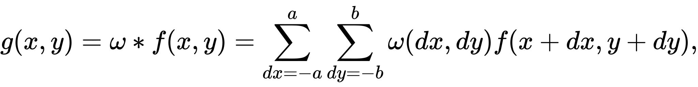
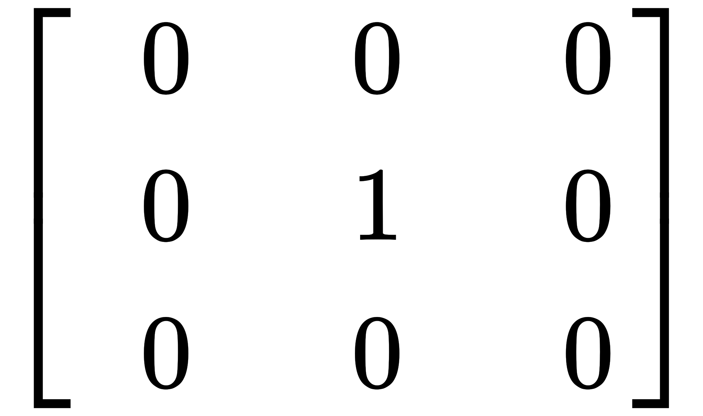
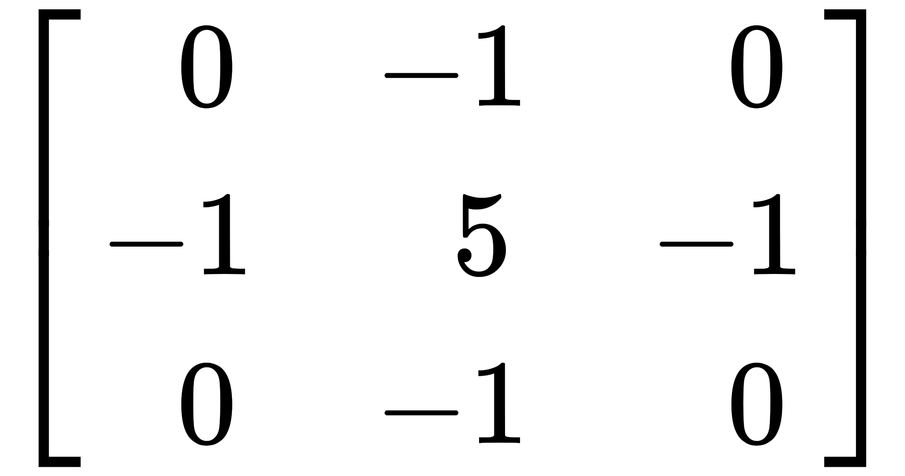
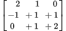
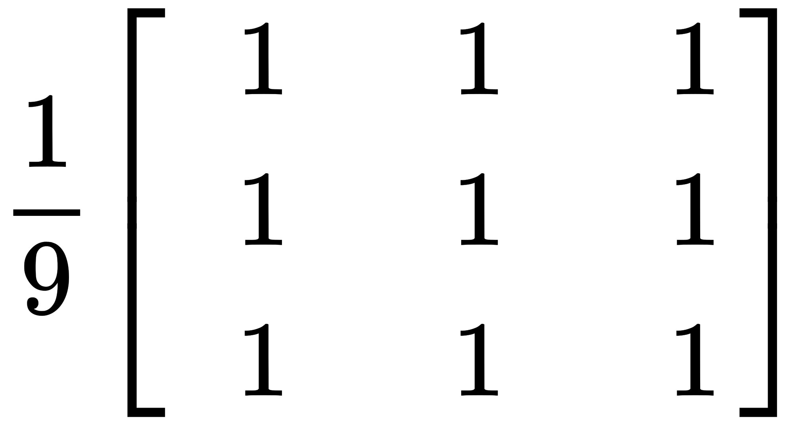

<h1 align="center">Kernel Convolutions</h1>

<div align="center">
  :camera: :clipboard: :books: :clipboard: :camera:
</div>

<div align="center">
  <strong>Computational Photography concepts implemented from scratch</strong>
</div>

<br />

## Table of Contents

- **Theory**
- **Implementation**
- **Steps to run**
- **Output**

<br />

- ### Theory

  In image processing, a kernel, convolution matrix, or mask is a small matrix. It is used for blurring, sharpening, embossing, edge detection, and more. This is accomplished by doing a convolution between a kernel and an image.
  A **kernel** is a matrix, which is slid across the image and multiplied with the input such that the output is enhanced in a certain desirable manner.
  <br/>
  **Convolution** is the process of adding each element of the image to its local neighbors, weighted by the kernel.
  The general expression of a convolution is
  
  Depending on the element values, a kernel can cause a wide range of effects.

- ### Implementation

  Depends on the various kernels an image can be processed to obtain different output results.
  The list of kernels implemented here are as follows:
  | Operation | Kernel |
  | --------- | ---------------------------------- |
  | Identity |  |
  | High Pass |  |
  | Sharpen |  |
  | Emboss |  |
  | Box Blur |  |

  An image is convoluted with one of the above kernels and provides us the appropriate output.
  the process of transforming images and convolution is as follows:

  1.  Insert padding of image based on the kernel size, here we are simply adding black pixels at the boundary of the image.
  2.  Convolute the image with the kernel, the algorithm and image for the convolution is as follows

      ```
      for each image row in input image:
          for each pixel in image row:

              set accumulator to zero

              for each kernel row in kernel:
                  for each element in kernel row:

                      if element position  corresponding* to pixel position then
                          multiply element value  corresponding* to pixel value
                          add result to accumulator
                      endif

              set output image pixel to accumulator
      ```

        <br/>

      
      <br/>

  3.  Apply Normalization on the Image.
      > Normalization is defined as the division of each element in the kernel by the sum of all kernel elements, so that the sum of the elements of a normalized kernel is unity. This will ensure the average pixel in the modified image is as bright as the average pixel in the original image.
  4.  Display the Image

- ### Steps to Run

  Make sure you have Python Installed in your computer. To check if you've python installed, run the following command in command prompt

  `Python --version`

  

  Once you have python Installed in your device follow the next steps to run the program:

  1. `git clone <Repository Link>`
  2. cd into the "Kernal_Convolutions" folder
  3. Run the following command

     `py Kernels.py`

  To Change the image open the code file and change the Image to your choice

  The Following Parameters which can be changed to adjust the form of output

  > Debug -> If True, The code will display image output after processing every step

  > Color -> If True, The code will go through "Colored Convolution" and all outputs would be displayed in "RGB Version" of Image. If False, The Code will convert the image into "GrayScale" and the output displayed will be in "Grayscale".

  > Save -> If True, the Output of the Image will be Saved in the Output Directory.

  > Resize -> If True, The Input Image will be Resized to a given ratio, you can change the ratio according to your needs.

- ### Output

  - #### **Input Image**

      

  - #### **Identity Image**

      

  - #### **Highpass Image**

      

  - #### **Sharpen Image**

      

  - #### **Emboss Image**

      

  - #### **Box Blur Image**

      
