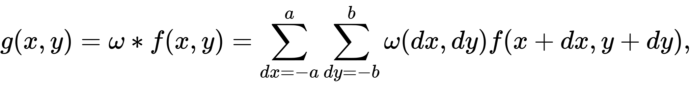

<h1 align="center">Computational Photography</h1>

  :camera: :clipboard: :books: :clipboard: :camera:

  <strong>Computational Photography concepts implemented from scratch</strong>

 

## Table of Contents

- [x] [Kernel Convolutions](#Kernel_Convolution)
- [x] [Gaussian Blur](#example)
- [x] [Blending Modes](#philosophy)
- [x] [Sobel Gradient Computation](#events)
- [x] [Canny Edge Detector](#state)
- [ ] [Gaussian Pyramid](#routing)
- [ ] [Laplacian Pyramid](#server-rendering)
- [ ] [Merge Two Images](#components)

 

- ### Kernel Convolution

  The general expression of a convolution is

  

  Depending on the element values, a kernel can cause a wide range of effects.
   

  **[Code](.\Kernel_Convolutions\Readme.md)**

 

- ### Gaussian Blur

  a Gaussian blur (also known as Gaussian smoothing) is the result of blurring an image by a Gaussian function

  The Gaussian blur is a type of image-blurring filters that uses a Gaussian function (which also expresses the normal distribution in statistics) for calculating the transformation to apply to each pixel in the image. The formula of a Gaussian function in one dimension is

  
   

  **[Code](.\Kernel_Convolutions\Readme.md)**

- ### Blending Modes

  Blend modes in digital image editing and computer graphics are used to determine how two layers are blended with each other. The default blend mode in most applications is simply to obscure the lower layer by covering it with whatever is present in the top layer. However, as each pixel has a numerical representation, there exist a large number of ways to blend two layers.

  - **List of Blend Modes**

    1.  Addition
    2.  Darken
    3.  Difference
    4.  Divide
    5.  Lighten
    6.  Multiply
    7.  Overlay
    8.  Screen
    9.  Subtraction

     

  **[Code](.\Kernel_Convolutions\Readme.md)**

- ### Sobel Gradient Computation

  The Sobel operator, sometimes called the Sobel–Feldman operator or Sobel filter, is used in image processing and computer vision, particularly within edge detection algorithms where it creates an image emphasising edges. At each point in the image, the result of the Sobel–Feldman operator is either the corresponding gradient vector or the norm of this vector. The Sobel–Feldman operator is based on convolving the image with a small, separable, and integer-valued filter in the horizontal and vertical directions and is therefore relatively inexpensive in terms of computations.

   

  

   

  **[Code](.\Kernel_Convolutions\Readme.md)**

- ### Canny Edge Detector

  The Canny edge detector is an edge detection operator that uses a multi-stage algorithm to detect a wide range of edges in images. It was developed by John F. Canny in 1986.
  Canny edge detection is a technique to extract useful structural information from different vision objects and dramatically reduce the amount of data to be processed.
   

  **Process of Canny Edge Detection algorithm:**

  1. Apply Gaussian filter to smooth the image in order to remove the noise
  2. Find the intensity gradients of the image
  3. Apply gradient magnitude thresholding or lower bound cut-off suppression to get rid of spurious response to edge detection
  4. Apply double threshold to determine potential edges
  5. Track edge by hysteresis: Finalize the detection of edges by suppressing all the other edges that are weak and not connected to strong edges.

   

  **[Code](.\Kernel_Convolutions\Readme.md)**

- ### Gaussian Pyramid

  In a Gaussian pyramid, subsequent images are weighted down using a Gaussian average (Gaussian blur) and scaled down. Each pixel containing a local average corresponds to a neighborhood pixel on a lower level of the pyramid. This technique is used especially in texture synthesis.

   

  **[Code](.\Kernel_Convolutions\Readme.md)**

- ### Laplacian Pyramid

  A Laplacian pyramid is very similar to a Gaussian pyramid but saves the difference image of the blurred versions between each levels. Only the smallest level is not a difference image to enable reconstruction of the high resolution image using the difference images on higher levels. This technique can be used in image compression.

   

  **[Code](.\Kernel_Convolutions\Readme.md)**
