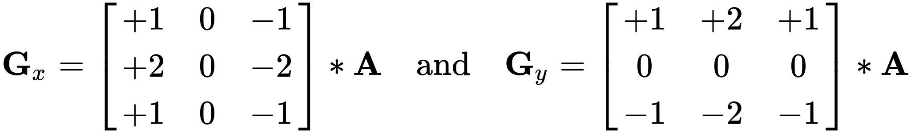
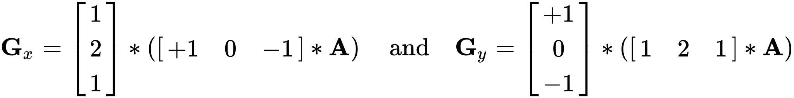
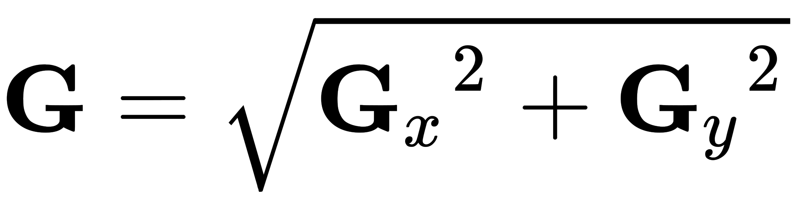
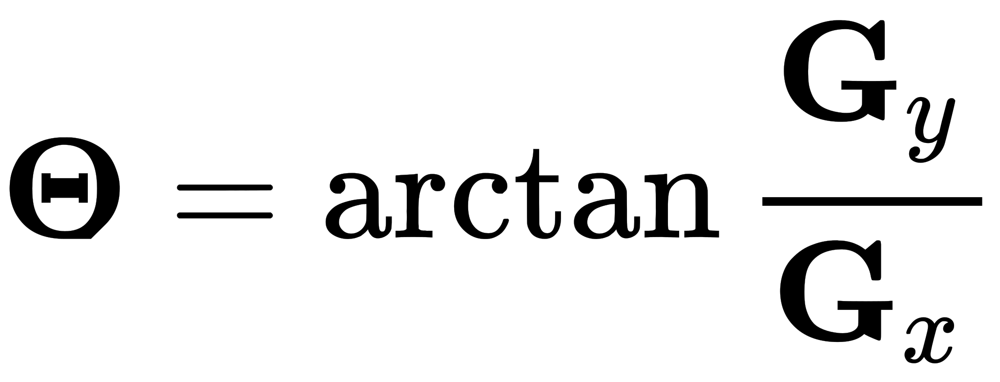

<h1 align="center">Sobel Gradient Computation</h1>

<div align="center">
  :camera: :clipboard: :books: :clipboard: :camera:
</div>

<div align="center">
  <strong>Computational Photography concepts implemented from scratch</strong>
</div>

<br />

## Table of Contents

- **Theory**
- **Implementation**
- **Steps to run**
- **Output**

<br />

- ### Theory

  The Sobel operator, sometimes called the Sobel–Feldman operator or Sobel filter, is used in image processing and computer vision, particularly within edge detection algorithms where it creates an image emphasising edges. At each point in the image, the result of the Sobel–Feldman operator is either the corresponding gradient vector or the norm of this vector. The Sobel–Feldman operator is based on convolving the image with a small, separable, and integer-valued filter in the horizontal and vertical directions and is therefore relatively inexpensive in terms of computations.

  The operator uses two 3×3 kernels which are convolved with the original image to calculate approximations of the derivatives – one for horizontal changes, and one for vertical. If we define A as the source image, and Gx and Gy are two images which at each point contain the horizontal and vertical derivative approximations respectively

  <br/>

  

  <br/>

- ### Implementation

  A Sobel Gradient Computation is typically generated by Smoothening the image using Gaussian Blur and then convolving an image with a Finite impulse Reponse kernel of Gaussian values.

  The Following Steps for implementing Sobel Gradient computation are:

  - Create Sobel kernel
  - Smoothen the image using Gaussian Blur
  - implement Convolution using the Sobel kernel on the resultant image

  For deeper knowledge on how Gaussian Blur works, Check this [Link](../Gaussian_Blur/Readme.md)

  Code for the algorithm in python language:

  ```
    kernel = np.array([[-1, 0, 1], [-2, 0, 2], [-1, 0, 1]])

    image = gaussian_blur(image, 3, debug)

    image = Sobel_Gradient_Computation(image, kernel, False)
  ```

  Since the Sobel kernels can be decomposed as the products of an averaging and a differentiation kernel, they compute the gradient with smoothing.

  

  The x-coordinate is defined here as increasing in the "right"-direction, and the y-coordinate is defined as increasing in the "down"-direction. At each point in the image, the resulting gradient approximations can be combined to give the gradient magnitude, using:

  

  Using this information, we can also calculate the gradient's direction:

  

  where, for example, Θ is 0 for a vertical edge which is lighter on the right side.

- ### Steps to Run

  Make sure you have Python Installed in your computer. To check if you've python installed, run the following command in command prompt

  `Python --version`

  

  Once you have python Installed in your device follow the next steps to run the program:

  1. `git clone <Repository Link>`
  2. cd into the "Sobel_Gradient_Computation" folder
  3. Run the following command

     `py Sobel_detection.py`

  To Change the image open the code file and change the Image to your choice

  The Following Parameters which can be changed to adjust the form of output

  > **Debug -> If True, The code will display image output after processing every step**

  > **Save -> If True, the Output of the Image will be Saved in the Output Directory.**

  > **Resize -> If True, The Input Image will be Resized to a given ratio, you can change the ratio according to your needs.**

  > **Kernel Size -> The Size of kernel size decides the Intensity of the gaussian blur, as for faster calculations in this program the Standard Deviation is kept constant (Square root of kernel size)**

- ### Output

  > **The intensity of Edge detection or gradient computation depends on the intensity of gaussian blur, so the larger the kernel size the less crisp the edge will be**

  - #### **Input Image**

    

  - #### **Sobel Gradient Computation with Gaussian Blur of Kernel Size = 3 Image**

    

  - #### **Sobel Gradient Computation with Gaussian Blur of Kernel Size = 9 Image**

    
